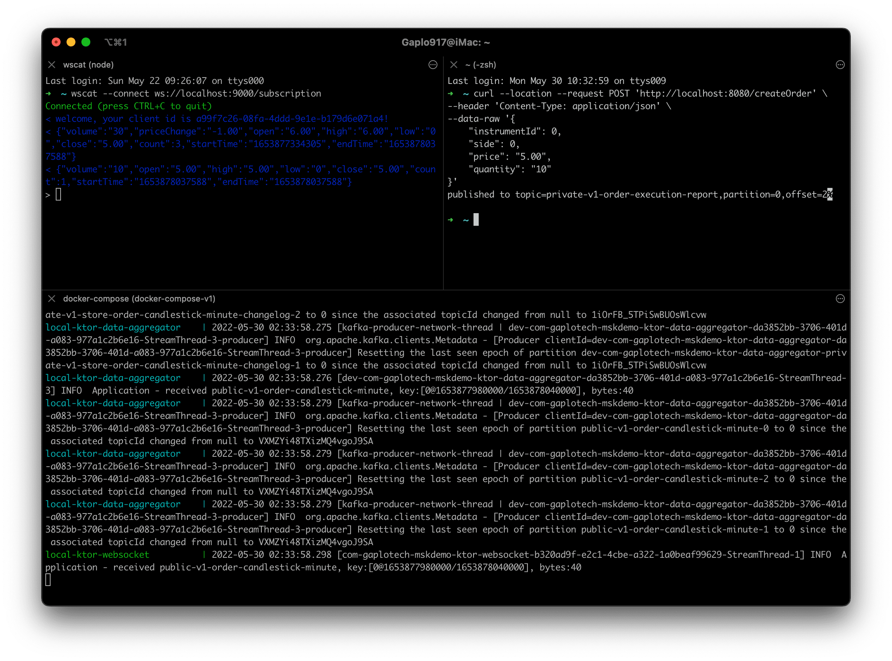

# AWS MSK Serverless Live Demo

This project consist of four projects. Each project has its own documentation in `README.md` 

[Getting started AWS MSK Serverless](https://docs.aws.amazon.com/msk/latest/developerguide/serverless-getting-started.html)

- [Producer](ktor-producer)
- [Data Aggregator](ktor-data-aggregator)
- [WebSocket](ktor-producer)
- [CDK for deployment](cdk)
- [Create Kafka topic and useful debug command](kafka-topic-scripts)

## Getting Started and Running (Local)

Step 1: Build the container services to local docker image
```bash
# build the producer
./ktor-producer/gradlew jibDockerBuild -p ktor-producer

# build the data aggregator
./ktor-data-aggregator/gradlew jibDockerBuild -p ktor-data-aggregator

# build the websocket
./ktor-websocket/gradlew jibDockerBuild -p ktor-websocket
```

Step 2: Start the Zookeeper and Kafka in daemon 
```bash
# init the zookeeper, kafka in background
docker-compose up -d zookeeper broker
``` 

Step 3: Create topics in Kafka
```bash
# init the zookeeper, kafka, kafka topics
docker-compose up init-kafka-topic-client
```

Step 4: Run the backend services
```bash
# after all topics created,
# boot up the rest ktor-data-aggregator, ktor-producer, ktor-websocket
docker-compose up ktor-data-aggregator ktor-producer ktor-websocket
``` 

Step 5: Install and connect WebSocket CLI clients to test it locally

Open a new terminal window
```bash
# install wscat (WebSocket CLI client)
npm install -g wscat

# connect to websocket
wscat --connect ws://localhost:9000/subscription

```

Step 6: Create an order

Open a new terminal window
```bash
# produce one data record (create order)
curl --location --request POST 'http://localhost:8080/createOrder' \
--header 'Content-Type: application/json' \
--data-raw '{
    "instrumentId": 0,
    "side": 0,
    "price": "5.00",
    "quantity": "10"
}'
```

## Expected Result
You should be able to see the result as following


## Exposed API
- Producer Application
  - http://localhost:8080/ping
  - http://localhost:9000/createOrder
- WebSocket
  - http://localhost:9000/ping
  - ws://localhost:9000/subscription
- Data Aggregator Application
    - http://localhost:8081/ping

## Deploy to AWS
```bash
# install AWS Cloud Development Kit
nvm install 16
nvm use 16
npm install -g aws-cdk

# deploy
cd cdk
cdk deploy EcrStack
cdk deploy VpcStack

# manually create AWS MSK Serverless, because cdk don't support it yet. https://github.com/aws/aws-cdk/issues/20362
# TBC a aws-cli to create AWS MSK Serverless

# build application docker image, follows the documentation of each repo
cdk deploy FargateStack
```

## Resources for learning

#### Always use jib to build java/kotlin image
https://cloud.google.com/java/getting-started/jib

#### Kotlin Coroutine (Actor model)
- https://kt.academy/article/cc-channel
- https://kotlinlang.org/docs/shared-mutable-state-and-concurrency.html#actors

#### Ktor websocket
- https://ktor.io/docs/websocket.html

#### Kafka Stream
- https://docs.confluent.io/platform/current/streams/developer-guide/dsl-api.html

#### AWS Glue (Kafka Schema Registry)
- https://aws.amazon.com/blogs/big-data/introducing-protocol-buffers-protobuf-schema-support-in-amazon-glue-schema-registry/
