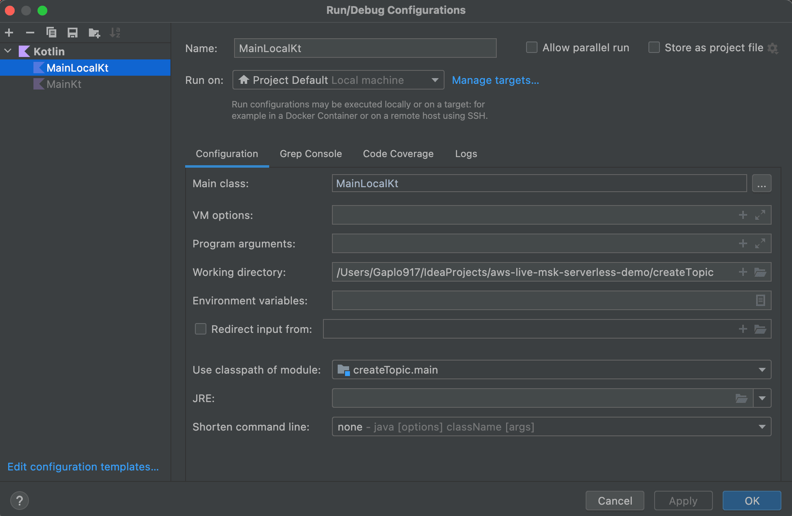

## Getting Started (Local)

1. use intellij ultimate to open this folder
2. click the run button of `MainLocal.kt`

## Remote Code Execution
1. change the kafka bootstrap server address i.e. `CommonClientConfigs.BOOTSTRAP_SERVERS_CONFIG`
2. click the run button of `Main.kt`
   
3. In "Run on", you could add an ssh tunnel and run remotely

# Resources for learning
See [here](https://github.com/gaplo917/aws-msk-v2-serverless-demo)