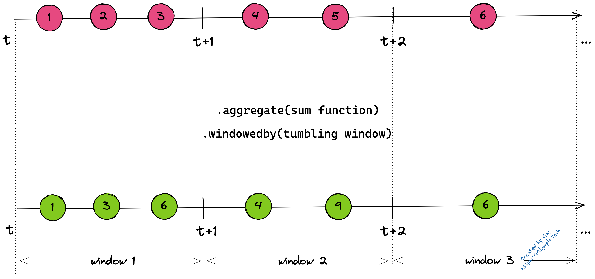
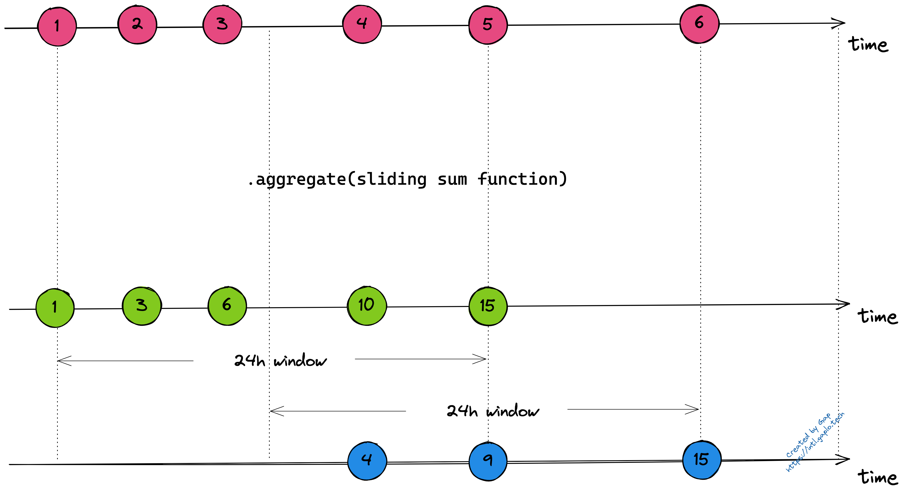
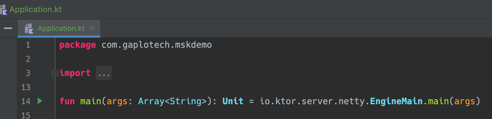
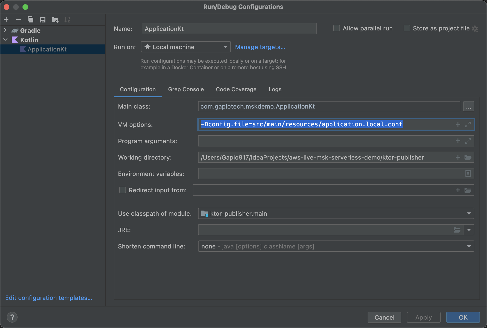

# AWS MSK Serverless Live Demo - Aggregator
This is a simple Ktor Kolint/JVM sample project to act an **Aggregator** in the 
[demo](https://github.com/gaplo917/aws-msk-v2-serverless-demo)

## Highlights
- Use Kafka Stream to build the aggregations
  - order execution reports -> 1 minute candlestick
  - order execution reports -> 24 hours sliding window trading statistic
- Use Google Protocol Buffer to efficiently do binary-serialization in the event log
- Use Kotlin language feature which are [operator function](https://kotlinlang.org/docs/operator-overloading.html) 
and [extension function](https://kotlinlang.org/docs/extensions.html)
  - `operator fun` to ease the source code reading
  - use extension to simplify the source code reading


## Kafka Topics
- order.execution.report
- order.candlestick.minute (tumbling window)
- order.sliding.aggregate.twentyfourhour (24 hours sliding)


## Tumbling Windows
Fixed time window.


## Sliding Windows
We need to have a snapshot of the stream data within the sliding window because when the new data
comes, we can dynamically calculate the 24h windows and drop unwanted data in the source.



## Local Development

1. start the local kafka in docker, See
2. Just start the arrow in `Application.kt`
   
3. Add `-Dconfig.file=src/main/resources/application.local.conf` in the "VM options"
   

## Local Deploy to AWS Elastic Container Registry

1. rename `.env.example` to `.env`
2. change the variables to your own 

```bash
# export environment variable to shell
set -o allexport
source .env
set +o allexport

./gradlew jib \
-Djib.from.image="amazoncorretto:11" \
-Djib.to.image="$ECR_REGISTRY/$ECR_REPOSITORY" \
-Djib.to.credHelper="ecr-login" \
-Djib.to.tags="latest,$TAG" \
-Djib.container.creationTime=USE_CURRENT_TIMESTAMP
```

# Resources for learning

See [here](https://github.com/gaplo917/aws-msk-v2-serverless-demo)