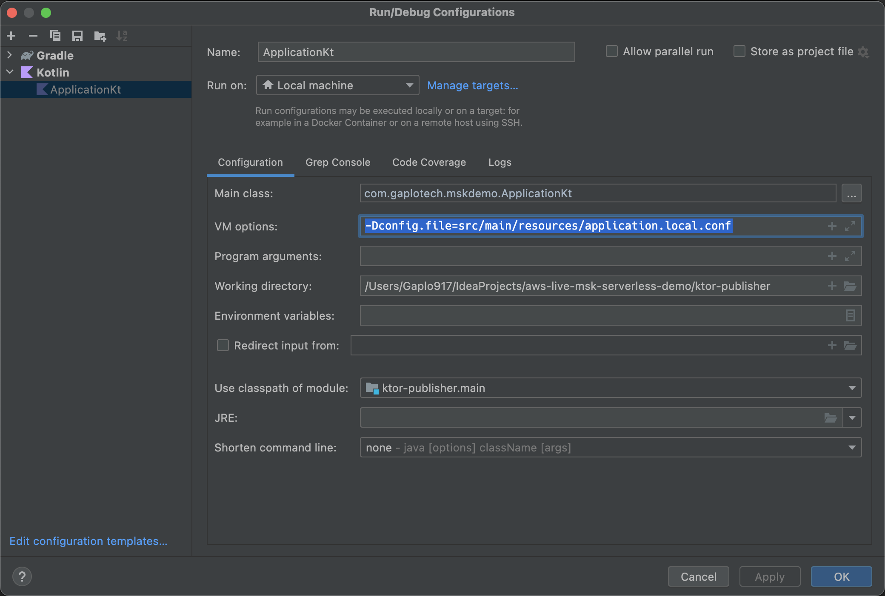

# AWS MSK Serverless Live Demo - Publisher and Websocket
This is a simple Ktor Kolint/JVM sample project to act a **Publisher & Websocket** in the 
[demo](https://github.com/gaplo917/aws-msk-v2-serverless-demo) 

## Highlights
- use API to publish a kafka records (easier to generate loading during demo)
- use websocket to push kafka stream aggregated data to client (real-time data)
- use Kotlin coroutine feature to handle shared mutable state without context switch in thread, 
See [the article](https://kotlinlang.org/docs/shared-mutable-state-and-concurrency.html#actors).


## API

GET http://localhost:8080/ping

GET http://localhost:8080/emitOrderExecutionReport/{insturmentId}

Websocket ws://localhost:8080/subscription

## Local Development

1. start the local kafka in docker, See 
2. Just start the arrow in `Application.kt`

3. Add `-Dconfig.file=src/main/resources/application.local.conf` in the "VM options"


## Local Build Docker Image
```bash
./gradlew jibDockerBuild \
-Djib.from.image="amazoncorretto:11" \
-Djib.to.image="local-ktor-websocket" \
-Djib.to.tags="latest" \
-Djib.container.creationTime=USE_CURRENT_TIMESTAMP 
```

## Build Docker Image to AWS Elastic Container Registry

1. rename `.env.example` to `.env`
2. change the variables to your own

```bash
# export environment variable to shell
set -o allexport
source .env
set +o allexport

./gradlew jib \
-Djib.from.image="amazoncorretto:11" \
-Djib.to.image="$ECR_REGISTRY/$ECR_REPOSITORY" \
-Djib.to.credHelper="ecr-login" \
-Djib.to.tags="latest,$IMAGE_TAG" \
-Djib.container.creationTime=USE_CURRENT_TIMESTAMP
```

# Resources for learning

See [here](https://github.com/gaplo917/aws-msk-v2-serverless-demo)